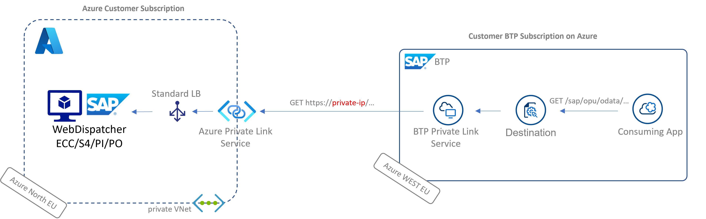

# az-private-linky-cap
CAP Project to get you started with [SAP BTP Private Link Service for Azure](https://help.sap.com/viewer/product/PRIVATE_LINK/CLOUD/en-US).

Find my blog post series on the topic [here](https://blogs.sap.com/2021/07/02/whatever-happens-in-an-azure-and-btp-private-linky-swear-stays-in-the-linky-swear/).

Additional Resources |
--- |
[Alternative Java Project using SAP Cloud SDK](https://github.com/MartinPankraz/az-private-linky) |
[Fiori Project using CAP or Java backend](https://github.com/MartinPankraz/az-products-ui) |
[iFlow example using CAP or Java backend](https://github.com/MartinPankraz/az-private-linky-integration-suite) |
[SAP's tutorial with CF CLI commands](https://developers.sap.com/tutorials/private-link-microsoft-azure.html) |
[SAP's official blog](https://blogs.sap.com/2021/06/28/sap-private-link-service-beta-is-available/) |

We used the `/sap/opu/odata/sap/epm_ref_apps_prod_man_srv` OData service for this project.

## Project context
[Azure Private Link Service](https://docs.microsoft.com/en-us/azure/private-link/private-link-service-overview) allows private connectivity between resources running on Azure in different environments. That includes SAP's Business Technology Platform when provisioned on Azure. SAP made that functionality available via a CloudFoundry Service.

Meaning you get now a managed component to expose your SAP backends to BTP on Azure without the need for a Cloud Connector. We developed against S4 primarily but anything executable in a service behind the Azure load balancer would be reachable. That involves for instance ECC, BO, PI/PO, SolMan etc.

## Destination config
key | value |
--- | --- |
Name | s4test |
URL | https://[your private IP]/ |
Proxy Type | Internet |
Authentication | whatever you have here. We tested Basic Auth initially |

### Additional Properties
key | value |
--- | --- |
sap-client | your client no |
TrustAll | true |
HTML5.DynamicDestination | true |
WebIDEEnabled | true |
WebIDEUsage | odata_abap |

TrustAll needed with https and if no code based approach to override verifier.

Reach out via the [GitHub Issues page](https://github.com/MartinPankraz/az-private-linky-cap/issues) of this reposto talk about it some more :-)
