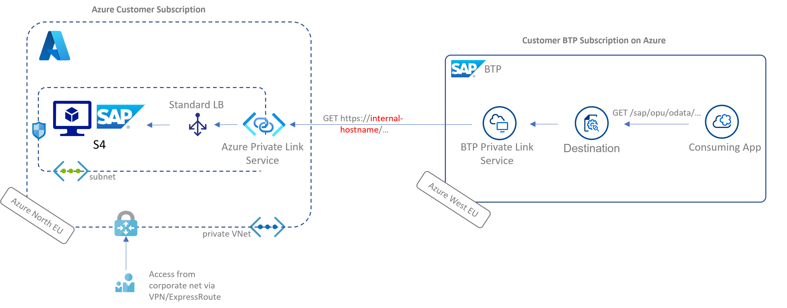

# az-private-linky-cap
CAP Project to get you started with [SAP BTP Private Link Service for Azure](https://help.sap.com/viewer/product/PRIVATE_LINK/CLOUD/en-US).

Find my blog post series on the topic [here](https://blogs.sap.com/2021/12/29/getting-started-with-btp-private-link-service-for-azure/).

Additional Resources |
--- |
[Alternative Java Project using SAP Cloud SDK](https://github.com/MartinPankraz/az-private-linky) |
[Fiori Project using CAP or Java backend](https://github.com/MartinPankraz/az-products-ui) |
[iFlow example using CAP or Java backend](https://github.com/MartinPankraz/az-private-linky-integration-suite) |
[SAP's tutorial with CF CLI commands](https://developers.sap.com/tutorials/private-link-microsoft-azure.html) |
[SAP's official blog](https://blogs.sap.com/2021/06/28/sap-private-link-service-beta-is-available/) |
[SAP's Discovery Center Mission](https://github.com/SAP-samples/s4hana-btp-extension-devops/tree/mission/05-PrivateLink)

We used the `/sap/opu/odata/sap/epm_ref_apps_prod_man_srv` OData service for this project.

## Project context
[Azure Private Link Service](https://docs.microsoft.com/en-us/azure/private-link/private-link-service-overview) allows private connectivity between resources running on Azure in different environments. That includes SAP's Business Technology Platform when provisioned on Azure. SAP made that functionality available via a CloudFoundry Service.

Meaning you get now a managed component to expose your SAP backends to BTP on Azure without the need for a Cloud Connector. We developed against S4 primarily but anything executable in a service behind the Azure load balancer would be reachable. That involves for instance ECC, BO, PI/PO, SolMan etc.

## Destination config
key | value |
--- | --- |
Name | s4test |
URL | https://[your private hostname]/ |
Proxy Type | PrivateLink |
Authentication | whatever you have here. We tested Basic Auth initially |

If your version of the CloudSDK doesn't support the new ProxyType revert to "Internet". Be aware this is only a configuration issue and by no means does the traffic flow to the internet. It will be resolved by BTP Azure DNS directly to the private link.

### Additional Properties
key | value |
--- | --- |
sap-client | your client no |
TrustAll | true |
HTML5.DynamicDestination | true |
WebIDEEnabled | true |
WebIDEUsage | odata_abap |

TrustAll needed with https, because CAP v1 does not apply Destination custom trust store yet. See [part 7](https://blogs.sap.com/2021/12/01/btp-private-linky-swear-with-azure-how-to-setup-ssl-end-to-end-with-private-link-service/) of the series for details.

> Note: Consider [upgrading](https://sap.github.io/cloud-sdk/docs/js/guides/upgrade-to-version-2) the Cloud SDK for Javascript to support the new proxy type PrivateLink.

Reach out via the [GitHub Issues page](https://github.com/MartinPankraz/az-private-linky-cap/issues) of this reposto talk about it some more :-)
